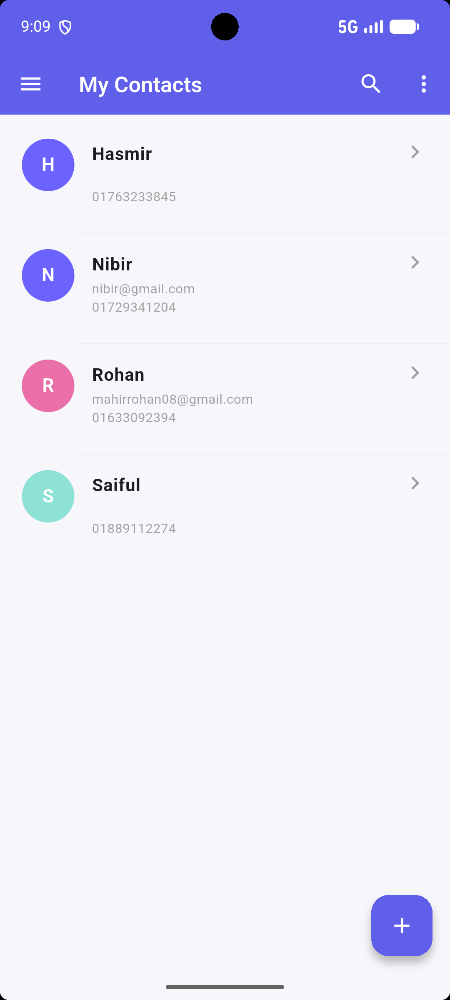
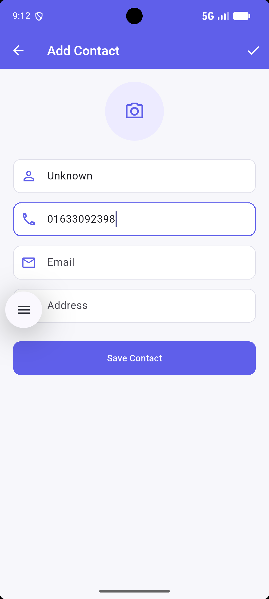
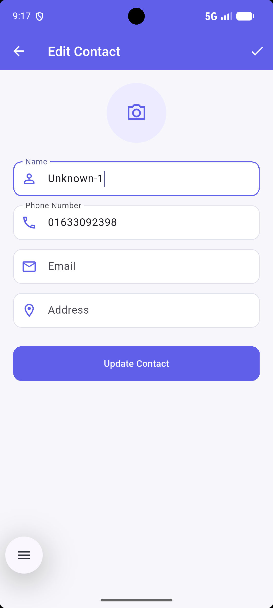
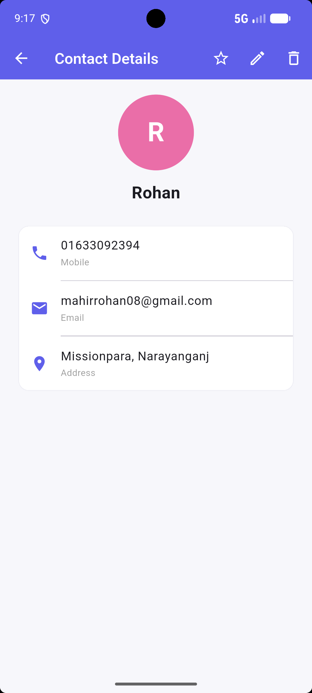
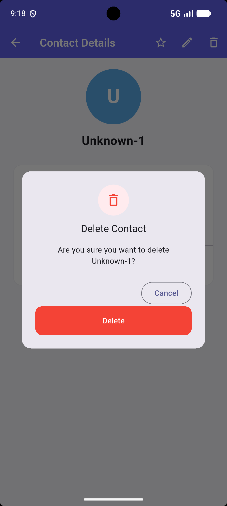
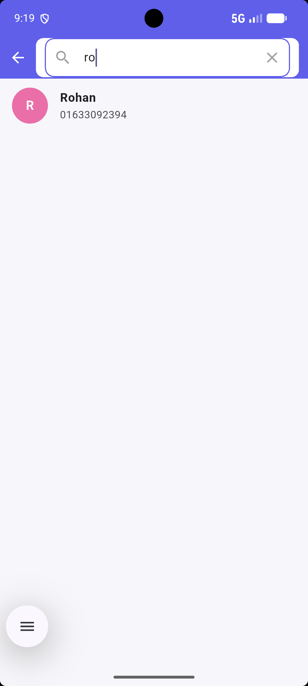
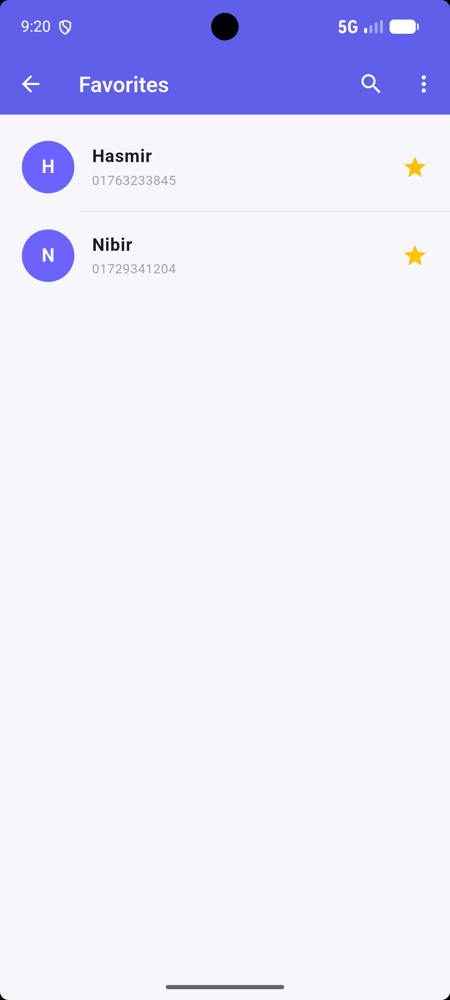
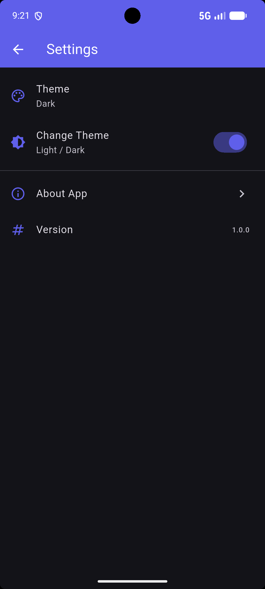

# Contact Management App (Flutter)

A local database CRUD contact manager built with Flutter and SQLite (sqflite).

## Features
- Add, view, update, delete contacts
- Search contacts by name
- Favorite contacts (bonus)
- Light/Dark theme toggle
- Local storage using SQLite

## Screenshots

| Contacts List | Add Contact | Edit Contact |
|---|---|---|
|  |  |  |

| Contact Details | Delete Confirm | Search |
|---|---|---|
|  |  |  |

| Favorites | Settings |
|---|---|
|  |  |

## Tech
- Flutter
- sqflite (local SQLite database)

## Run
\`\`\`
flutter pub get
flutter run
\`\`\`